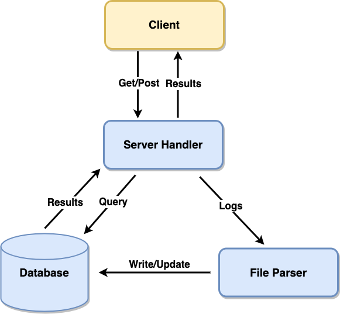

## Description

[

The server includes three components: a server handler, a file parser, and a risk database. Server Handler will be in charge of client communication, forwarding updated logs, and querying database based on user requests. File Parser will parse the logs and insert the corresponding data into the risk database. The risk database will store all risk information.

## Major Classes & Functions Description

### Class: Handler

Handle communication with user, forward updated logs, and query database based on user requests.

**handle\_\{user, ip, device, internal\}\_check(request):**
Input: HTTP Get Request
Output: HTTP Response (String: true/false)
Check if the request objective exists in the database or meet the condition

**handle\_\{succ, fail\}\_logindate(request):**
Input: HTTP Get Request
Output: HTTP Response (String: timestamp/No record)
Return the last failed/successful login date for the given user

**handle_fail_logincount(request):**
Input: HTTP Get Request
Output: HTTP Response (Int)

**handle_log(request):**
Input: HTTP Post File Request
Output: HTTP Response (String: Log uploaded)

---

### Class: ParseFile

**parse_timestamp(timestamp):**
Input: String timestamp with format: '%Y-%m-%dT%H:%M:%S.%fZ'
Output: Float Unix time
Transform string timestamp to unix time for easier comparison and storage

**parse_unixtime(unix_time):**
Input: Float Unix time
Output: String timestamp with format: '%Y-%m-%dT%H:%M:%S.%fZ'
Transform unix time to string timestamp for returning the result to clients

**parse_content(content):**
Input: String Plain text log
Parse the logs and update the information to the database

---

### Class: RiskDB

**previous_week_range():**
Output: Int last weektime start unix integer, last weektime end unix integer
This function is used to set the starting and ending time of last week (based on the current runtime)
This function is not currently used in this implementation but prepared for future usage.

**set\_known\{User, IP, Device\}list( \{usernam, ip, deviceID\} ):**
Input: String username; ip; Device ID
Update the list if the objective hasn't been stored

**set_{successful, failed}LoginDict(username, unix_time):**
Input: String username and Float unix time
Update the dict if user has already been stored, otherwise create the key-value pair

**set_failedLoginCount(unix_time):**
Input: Float unix time
In this implementation, once there's a failed login, the counter will add one. However, the function can be changed (Commented block) to decide if the failed date is within the range of last week.
